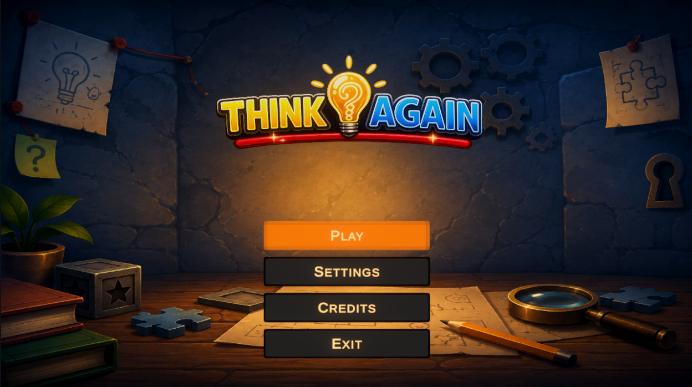
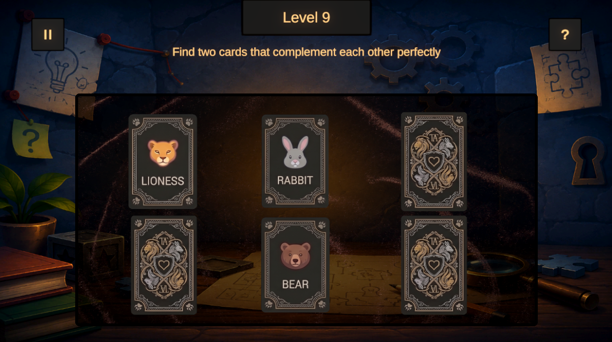
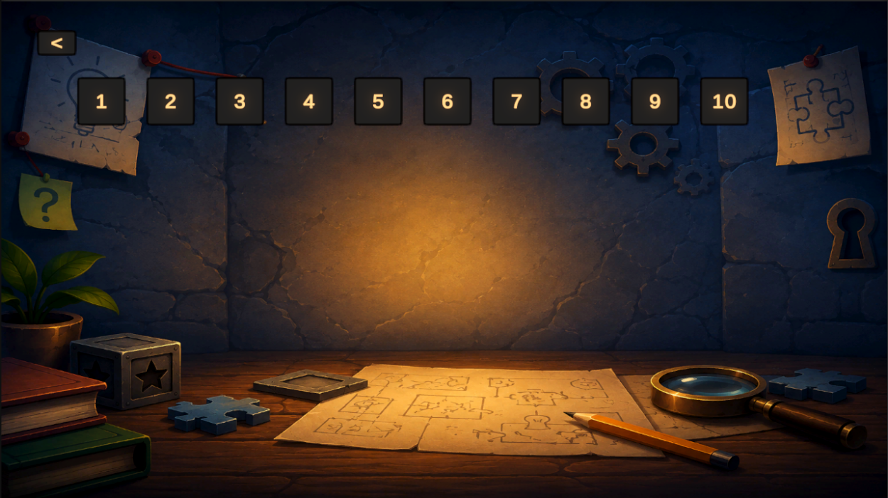

# 🧩 Think Again

> Puzzle-гра, де рішення іноді лежить прямо перед очима… але мозок вирішує цього не помічати.

---

# 📖 Про гру

Це гра-головоломка з рівневою структурою, у якій кожен рівень — окрема загадка з інтерактивними елементами та нестандартними рішеннями.

Основний фокус гри:
- взаємодія з об'єктами,
- уважність,
- логіка,
- експерименти з елементами на сцені.

---

# 🎮 Геймплей

Кожен рівень містить:
- ⏸️ кнопку паузи
- 💡 кнопку підказки
- 🧩 загадку
- 🎯 інтерактивні елементи

---

# ⚡ Механіки

У грі можна:

- 🖱️ Натискати на об'єкти
- ✋ Перетягувати елементи
- 🧪 Комбінувати предмети для створення нових

---

# 🏆 Як пройти рівень

Залежно від загадки потрібно:

- знайти правильний елемент;
- натиснути на потрібний об'єкт;
- скомбінувати елементи для отримання нового.

---

# 🎨 Візуальний стиль

- Простий візуал
- Чистий мінімалістичний UI
- Фокус на читабельності та взаємодії

---

# 📸 Скріншоти

## 🏠 Головне меню

---

## 🧩 Рівень

---

## ✨ Вибір рівня

---

# 🛠️ Технології

- 🎮 Unity
- 💻 C#
- 🧠 Custom Puzzle Logic

---

# 🚀 Запуск

>Якщо гра сподобалась — постав ⭐ репозиторію.
>Мотивація розробників напряму залежить від кількості зірочок :)

## 🚀 [PLAY NOW]([Think Again by indimax, Layyyzi Games](https://indimax.itch.io/think-again))
